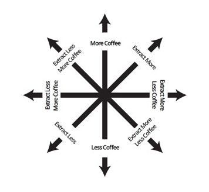

# Principles of coffee brewing  

A cup of coffee is a solution comprised of coffee particles (the solute) and water (the solvent).

The process of making a cup of coffee is called **coffee brewing**. Despite involving only two ingredients, coffee brewing is a complex process with several delicate variables.

In this document, you'll learn:
- [What is coffee brewing](#what-is-coffee-brewing) 
- [Variables of coffee brewing](variables-of-coffee-brewing)
- [Physical properties of brewed coffee](#physical-properties-of-brewed-coffee)  
- [Putting it all together](#putting-it-all-together) 

## What is coffee brewing       
Brewing coffee involves three simple steps: 
1. A coffee grinder breaks down coffee beans into smaller particles called **coffee grounds**. 
2. Hot water contacts the coffee grounds. 
3. A filter separates the coffee grounds from the resulting solution.  
 
You can brew coffee with a variety of **brewing methods**, which uniquely affect how coffee tastes. Some common brewing methods include: 
- The **drip** brewing method involves an automatic coffee maker dispensing hot water over a filter basket filled with coffee grounds. 
- The **pour over** brewing method involves manually pouring hot water over a funnel-shaped device lined with a paper filter. 
- The **french press** brewing method involves steeping coffee grounds in hot water for several minutes, then pressing a filter through the solution. 

## Variables of coffee brewing 
Five important variables are at play in the coffee brewing process:  

- **Ratio**: The ratio of coffee grounds to water affects coffee brewing. For now, know that this ratio-weight of coffee per unit of water-is called a **brewing recipe**. To keep brewing recipes consistent, baristas use scales to weigh out coffee and water in grams or ounces. 
- **Grind size:** The particle size of ground coffee affects brewing. For now, know that large a **course grind** resists water, whereas a **fine grind** easily dissolve in water. Because grind size is a major brewing variable, baristas invest in high-quality coffee grinders that ensure a uniform grind size. 
- **Time:** How long water and coffee contact each other affects brewing. For now, know that the longer water contacts coffee grounds, the more water dissolves the coffee grounds. 
- **Temperature:** Water temperature affects brewing. For now, know that the hotter water is, the more aggressively it dissolves coffee. 
- **Water quality:** The chemical makeup of water also affects brewing. For now, keep these two things in mind:  
- Acidic water dissolves coffee more aggressively than basic water does. 
- Water high in calcium and magnesium dissolves coffee more aggressiv

## Physical properties of brewed coffee 
Even the slightest changes to the brewing variables dramatically changes the physical properties of brewed coffee.

The physical properites of brewed coffee include: 

- **Strength:** 
- **Extraction:** 

Strength and extracton are important because they determine how brewed coffee tastes. See the **flavor map** below for the flavors associated with strength and extraction. 

## Putting it all together  
The flavor map shows that appealing brewed coffee depends on finding optimal levels of strength and extraction. These optimal level change according to origin, roast, and personal preference. 
     
To find optimal levels of strength and extracton for your coffee and preferences, use the **flavor map** and **flavor compass** figures in these steps: 

1. **Find where your brew sits** on the flavor map. That spot is the center of the coffee compass.
2. **Optimize strength** according to the flavor compass: 
    - Use more coffee to make brewed coffee stronger.
    - Use less coffee to make brewed coffee weaker.

     
3. **Optimize extraction** according to the flavor compass:  
    - To extract more: 
        - Make grind finer.
        - Extend brew time. 
    - To extract less: 
        - Make grind courser.
        - Shorten brew time.
     
> **Note about extraction:** You can also change water temperature or chemical makeup; however, it is recommended that you keep these variables consistent. Most coffee professionals recommend filtered drinking water heated to 195-200 degrees Fahrenheit. 
> > **Note about strength:** To alter strength, adjust the weight of coffee used while keeping the amount of water the same. This will minimize the effect of other variables, such as brew time. 
