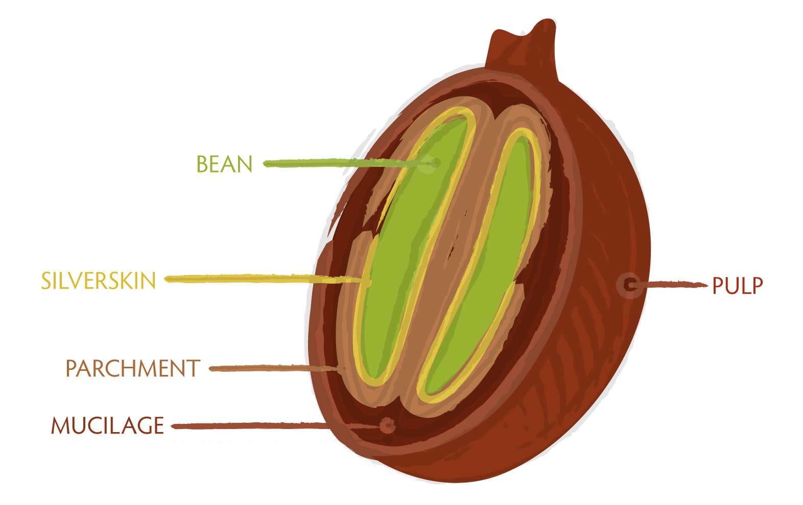
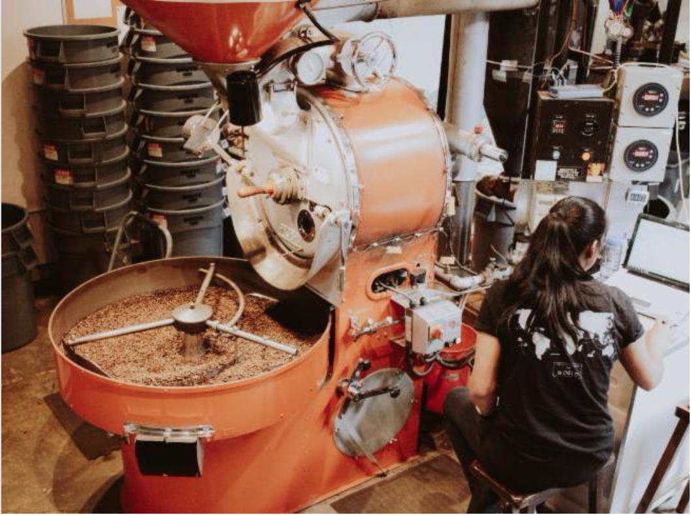

# Where coffee comes from   

**Coffee plants** 
Coffee comes from the seeds within the cherries of a coffee plant. 

Coffee plants come in different **species** and **varietals** that produce coffee with unique sensory characteristics. **Coffea arabica** and **Coffea robusta** are the most common species of coffee plants, with Coffea arabaca being more sought after because of its superior aroma and flavor. The varietals of each species of coffee plant also affect the way coffee will taste. 
 
**Origin** 
The place coffee is grown–its **origin**–also matters. Because coffee plants thrive in tropical climates, most coffee is grown in a ring of regions near the equator called the **coffee belt**. Each of the places within the coffee belt also affect the way coffee tastes, which is why coffee is often named after its origin. For example, *Sumatra* signals coffee that will taste earthy and zesty; *Ethiopa Yirgacheffe* signals sweet and floral. 

**Processing** 
Once a crop of coffee ripens, farmers pick the ripe cherries. Next, farmers must safely extract the coffee seeds from the cherries through a procdure called **processing**. The most common method of processing is **washed processing**, which works in these steps:  
1. The cherries pass through a de-pulper machine that removes the outer layer called the pulp.
2. The de-pulped cherries ferment in large vats until their mucilage layers detoriate.
3. Farmers rinse and agitate the fermented cherries to remove any remaining mucilage. 
4. Farmers dry and rake the cherries on raised cement beds.
5. The dry cherries pass through a mill that removes the skin and parchment layers. 

What started as a cherry, is now a seed that resembles a pale coffee bean. This freshly processed coffee bean is called green coffee, and it must go through one last production stage before it's ready to be made into a delicious cup of coffee. 

**Roasting** 
Coffee roasting refers to the cooking of green coffee beans to release their full flavor potential. Coffee roasting is a complex craft, but these are the basics you should know: 
- Drum roasters apply uniform heat to the green coffee.  
- The longer coffee roasts, the darker it gets. 
- In general, lighter roasted coffee retains more of its natural fruity and floral flavors, while darker coffee carmelizes into nutty, chocolatey flavors. 
- The slightest changes in time and temperature drastically affect how a coffee will taste. 
